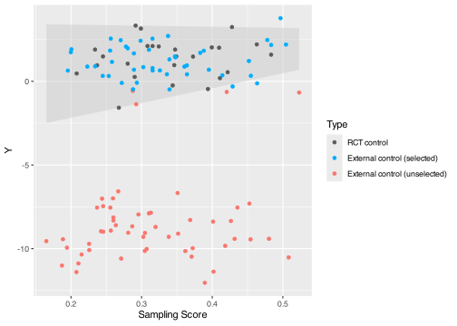

<!-- README.md is generated from README.Rmd. Please edit that file -->

# intFRT

<!-- badges: start -->
<!-- badges: end -->

The goal of **intFRT** is to **int**egrate randomized controlled trials
(RCTs) with external controls (ECs) in hybrid controlled trials,
harnessing Fisher randomization tests (**FRT**) and Conformal Selective
Borrowing (CSB). It enhances the statistical efficiency of average
treatment effect (ATE) estimation and inference while ensuring valid
hypothesis testing. Key features include:

- Fisher randomization tests (FRT) in hybrid controlled trials, ensuring
  strict control of the Type I error rate.

- Conformal Selective Borrowing (CSB) serves as both an ATE estimator
  and a test statistic for FRT, enabling selective borrowing of
  comparable ECs to reduce hidden bias and improve statistical power.

- Adaptive determination of the selection threshold for CSB.

- The package also provides No Borrowing and various EC borrowing
  estimators (IPW, staIPW, CW, OM, AIPW, ACW), along with their
  inference results based on asymptotic normality for comparison.

## Installation

You can install the development version of intFRT from
[GitHub](https://github.com/) with:

``` r
# install.packages("pak")
pak::pak("ke-zhu/intFRT")
```

## Example

This example illustrates the use of the Fisher Randomization Test (FRT)
and Conformal Selective Borrowing methods in hybrid controlled trials.

### Simulate data for a hybrid controlled trial

``` r
set.seed(1)
n_rct <- 50  # Number of observations in the randomized controlled trial
n_ec <- 100  # Number of external controls
n <- n_rct + n_ec  # Total number of observations

# Covariates (2 covariates, uniformly distributed)
X <- matrix(runif(n * 2), n, 2)

# Treatment assignment (1 = treatment, 0 = control)
A <- c(rep(0:1, each = n_rct / 2), rep(0, n_ec))

# Data source indicator (1 = randomized trial, 0 = external control)
S <- c(rep(1, n_rct), rep(0, n_ec))

# Generate potential outcomes (continuous)
Y1 <- 1 + 2 * X[,1] + 0.1 * X[,2] + rnorm(n)
Y0 <- 2 * X[,1] + 0.1 * X[,2] + rnorm(n)

# Introduce bias in half of the external controls
id_biased_EC <- tail(which(S == 0), n = n_ec / 2)
Y0[id_biased_EC] <- Y0[id_biased_EC] - 10

# Observed outcome
Y <- A * Y1 + (1 - A) * Y0
```

### Adaptive selection threshold

``` r
library(intFRT)
ada_g <- compute_ada_gamma(
  Y, A, S, X, 
  # Use a small n_rep_gamma for fast illustration; 
  # recommend n_rep_gamma = 100 for more stable results
  n_rep_gamma = 10
)
#> For gamma_sel = 0, MSE = 1.65135405498681
#> 
#> For gamma_sel = 0.1, MSE = 0.0561366258485774
#> 
#> For gamma_sel = 0.2, MSE = 0.0374034434644345
#> 
#> For gamma_sel = 0.3, MSE = 0.0742880174715587
#> 
#> For gamma_sel = 0.4, MSE = 0.0964136504224823
#> 
#> For gamma_sel = 0.5, MSE = 0.218671681962682
#> 
#> For gamma_sel = 0.6, MSE = 0.0945245180126159
#> 
#> For gamma_sel = 0.7, MSE = 0.206554346082695
#> 
#> For gamma_sel = 0.8, MSE = 0.135088360512019
#> 
#> For gamma_sel = 0.9, MSE = 0.243325393833669
#> 
#> For gamma_sel = 1, MSE = 0.12007616488232
ada_g
#> [1] 0.2
```

### Fisher Randomization Test with Conformal Selective Borrowing

``` r
result_csb <- ec_borrow(
  Y = Y,
  A = A,
  S = S,
  X = X,
  method = "Conformal Selective Borrow AIPW",
  family = "gaussian",
  gamma_sel = ada_g,
  # FRT with 10 randomizations for illustration
  # recommend n_fisher = 5000 for more powerful results
  n_fisher = 10
)

# View results
print(result_csb$res, width = Inf)
#> # A tibble: 2 × 9
#>   method                                 est     se   ci_l  ci_u  p_value n_sel
#>   <chr>                                <dbl>  <dbl>  <dbl> <dbl>    <dbl> <dbl>
#> 1 Conformal Selective Borrow AIPW      0.875  0.247  0.391  1.36 0.000393    44
#> 2 Conformal Selective Borrow AIPW+FRT NA     NA     NA     NA    0.0909      NA
#>   ess_sel runtime
#>     <dbl>   <dbl>
#> 1    35.7  0.0510
#> 2    NA    0.470
```

- `est`: ATE estimate.
- `se`, `ci_l`, `ci_u`, `p_value` (first row): Standard error,
  confidence interval, p-value based on asymptotic normality.
- `p_value` (second row): P-value based on FRT.
- `n_sel`: The number of borrowed external controls.
- `ess_sel`: The effective sample size of borrowed external controls.
- `runtime`: The computation time.

``` r
# View IDs of borrowed external controls
result_csb$id_sel
#>  [1]  51  52  53  54  55  56  57  58  60  62  63  64  65  66  67  68  69  71  72
#> [20]  73  74  75  76  77  78  79  81  82  83  84  85  86  88  90  91  92  93  94
#> [39]  95  96  97  98  99 100
```

### Visualize borrowed external controls

``` r
library(dplyr)
#> 
#> Attaching package: 'dplyr'
#> The following objects are masked from 'package:stats':
#> 
#>     filter, lag
#> The following objects are masked from 'package:base':
#> 
#>     intersect, setdiff, setequal, union
library(ggplot2)
library(forcats)
library(quantreg)
#> Loading required package: SparseM

# Mark borrowed external controls for plotting
sel <- rep(0, length(Y))
sel[result_csb$id_sel] <- 1

# Fit sampling score for multiple covariates 
`Sampling Score` <- glm(S ~ X) %>% predict(type = "response")

# Prepare data for plotting
dat_plot <- tibble(Y, A, S, X, `Sampling Score`, sel) %>% 
  mutate(
    Type = case_when(
      A == 1 & S == 1 ~ "RCT treated",
      A == 0 & S == 1 ~ "RCT control",
      A == 0 & S == 0 & sel == 1 ~ "External control (selected)",
      A == 0 & S == 0 & sel == 0 ~ "External control (unselected)"
    ) %>% 
      as_factor %>% 
      fct_relevel(
        "RCT treated", "RCT control", 
        "External control (selected)", "External control (unselected)"
      )
  ) %>% 
  filter(Type != "RCT treated")

# Fit quantile regressions to visualize the main range of RCT controls
fit975 <- rq(Y ~ `Sampling Score`, tau = 0.975, data = dat_plot, 
             subset = dat_plot$Type == "RCT control")
dat_plot$pred975 <- predict(fit975, newdata = dat_plot)

fit025 <- rq(Y ~ `Sampling Score`, tau = 0.025, data = dat_plot, 
             subset = dat_plot$Type == "RCT control")
dat_plot$pred025 <- predict(fit025, newdata = dat_plot)

# Plot results
dat_plot %>% 
  ggplot() +
  geom_ribbon(aes(`Sampling Score`, ymin = pred025, ymax = pred975), 
              fill = "grey80", alpha = 0.5) +
  geom_point(aes(`Sampling Score`, Y, color = Type)) +
  scale_color_manual(values = c("#5A5A5A", "#00ADFA", "#F8766D"))
```



The above figure shows that Conformal Selective Borrowing discards
uncomparable ECs and borrows most of the comparable ECs, except for a
few suspicious ones.
