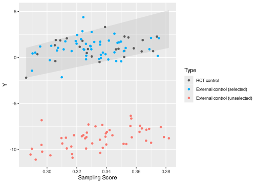

<!-- README.md is generated from README.Rmd. Please edit that file -->

# intFRT

<!-- badges: start -->

<!-- badges: end -->

**intFRT** helps **int**egrate randomized controlled trials (RCTs) with
external control data (ECs) to make treatment comparisons more accurate
and reliable in hybrid controlled trials. It uses Fisher Randomization
Tests (**FRT**) to provide exact finite-sample inference, and Conformal
Selective Borrowing (CSB) to selectively include comparable external
controls, reducing bias and improving statistical power. This makes the
results more robust and informative when integrating clinical trial data
with real-world evidence.

🎲 **Fisher Randomization Tests (FRT):** Strict Type I error control in
hybrid controlled trials.

🧲 **Conformal Selective Borrowing (CSB):** Selectively borrows
comparable ECs to reduce bias and improve power.

⚙️ **Adaptive Selection Threshold:** Automatically determines how much
external data to borrow through CSB.

📊 **Flexible Estimator Options:** Offers No Borrowing and various EC
borrowing estimators (IPW, staIPW, CW, OM, AIPW, ACW) with inference
results based on asymptotic normality. These estimators can also be used
as test statistics in FRT.

📦 **Built-in Dataset:** `lungcancer` is a semi-synthetic dataset based
on the CALGB 9633 trial and EHR data. It includes internal and external
treated/control groups, preserves covariate mismatch between sources,
and is designed for evaluating hybrid controlled trials and data fusion
methods. All values are simulated and de-identified. Try
`head(lungcancer)` to explore.

💻 **Simulation Code:** Companion code for the ICML 2025 paper is
available at <https://github.com/ke-zhu/frt-csb-code>

📖 **Citation:** If you use this package, dataset, or code, please cite:

> Ke Zhu, Shu Yang, and Xiaofei Wang (2025). [Enhancing Statistical
> Validity and Power in Hybrid Controlled Trials: A Randomization
> Inference Approach with Conformal Selective
> Borrowing.](https://icml.cc/virtual/2025/poster/44990) In *Proceedings
> of the 42nd International Conference on Machine Learning (ICML)*.
> [\[arXiv\]](https://arxiv.org/abs/2410.11713)
> [\[Slides\]](https://drive.google.com/file/d/1LkTDY12CjUL0BAGQAt4JmOBlgk-MN3Ix/view?usp=sharing)
> [\[Poster\]](https://drive.google.com/file/d/1g5vFT6irtPWFQWwh6AGe-iYCvMF4z0B2/view?usp=share_link)

## Installation

You can install the development version of intFRT from
[GitHub](https://github.com/) with:

``` r
# install.packages("devtools")
devtools::install_github("ke-zhu/intFRT")
```

## Example

This example illustrates the use of the Fisher Randomization Test (FRT)
and Conformal Selective Borrowing methods in hybrid controlled trials.

### Simulate data for a hybrid controlled trial

``` r
set.seed(2025)
n_rct <- 50  # Number of observations in the randomized controlled trial
n_ec <- 100  # Number of external controls
n <- n_rct + n_ec  # Total number of observations

# Covariates (2 covariates, uniformly distributed)
X <- matrix(runif(n * 2), n, 2)

# Treatment assignment (1 = treatment, 0 = control)
A <- c(rep(0:1, each = n_rct / 2), rep(0, n_ec))

# Data source indicator (1 = randomized trial, 0 = external control)
S <- c(rep(1, n_rct), rep(0, n_ec))

# Generate potential outcomes (continuous)
Y1 <- 1 + 2 * X[,1] + 0.1 * X[,2] + rnorm(n)
Y0 <- 2 * X[,1] + 0.1 * X[,2] + rnorm(n)

# Introduce bias in half of the external controls
id_biased_EC <- tail(which(S == 0), n = n_ec / 2)
Y0[id_biased_EC] <- Y0[id_biased_EC] - 10

# Observed outcome
Y <- A * Y1 + (1 - A) * Y0
```

### Adaptive selection threshold

``` r
library(intFRT)
library(furrr)
#> Loading required package: future
ada_g <- compute_ada_gamma(
  Y, A, S, X, 
  n_rep_gamma = 100,
  parallel = TRUE
)
#> Gamma = 0.00 | MSE = 0.6009
#> Gamma = 0.10 | MSE = 0.0392
#> Gamma = 0.20 | MSE = 0.0419
#> Gamma = 0.30 | MSE = 0.0421
#> Gamma = 0.40 | MSE = 0.0436
#> Gamma = 0.50 | MSE = 0.0468
#> Gamma = 0.60 | MSE = 0.0534
#> Gamma = 0.70 | MSE = 0.0525
#> Gamma = 0.80 | MSE = 0.0562
#> Gamma = 0.90 | MSE = 0.0640
#> Gamma = 1.00 | MSE = 0.0723
ada_g
#> [1] 0.1
```

### Fisher Randomization Test with Conformal Selective Borrowing

``` r
result_csb <- ec_borrow(
  Y = Y,
  A = A,
  S = S,
  X = X,
  method = "Conformal Selective Borrow AIPW",
  family = "gaussian",
  gamma_sel = ada_g,
  # FRT with 10 randomizations for illustration
  # Recommend `n_fisher = 5000` or more
  # To perform only Conformal Selective Borrowing, set `n_fisher = NULL`
  n_fisher = 10
)

# View results
print(result_csb$res, width = Inf)
#> # A tibble: 2 × 9
#>   method                                est     se   ci_l  ci_u  p_value n_sel
#>   <chr>                               <dbl>  <dbl>  <dbl> <dbl>    <dbl> <dbl>
#> 1 Conformal Selective Borrow AIPW      1.37  0.206  0.961  1.77 3.60e-11    48
#> 2 Conformal Selective Borrow AIPW+FRT NA    NA     NA     NA    9.09e- 2    NA
#>   ess_sel runtime
#>     <dbl>   <dbl>
#> 1    44.5   0.921
#> 2    NA     0.578
```

- `est`: ATE estimate.
- `se`, `ci_l`, `ci_u`, `p_value` (first row): Standard error,
  confidence interval, p-value based on asymptotic normality.
- `p_value` (second row): P-value based on FRT.
- `n_sel`: The number of borrowed external controls.
- `ess_sel`: The effective sample size of borrowed external controls.
- `runtime`: The computation time.

``` r
# View IDs of borrowed external controls
result_csb$id_sel
#>  [1]  51  52  53  54  55  56  57  58  60  61  62  63  64  65  66  67  68  69  70
#> [20]  71  72  73  74  75  76  77  78  79  80  82  83  84  85  86  87  88  89  90
#> [39]  91  92  93  94  95  96  97  98  99 100
```

### Visualize borrowed external controls

``` r
library(dplyr)
#> 
#> Attaching package: 'dplyr'
#> The following objects are masked from 'package:stats':
#> 
#>     filter, lag
#> The following objects are masked from 'package:base':
#> 
#>     intersect, setdiff, setequal, union
library(ggplot2)
library(forcats)
library(quantreg)
#> Loading required package: SparseM

# Mark borrowed external controls for plotting
sel <- rep(0, length(Y))
sel[result_csb$id_sel] <- 1

# Fit sampling score for multiple covariates 
`Sampling Score` <- glm(S ~ X) %>% predict(type = "response")

# Prepare data for plotting
dat_plot <- tibble(Y, A, S, X, `Sampling Score`, sel) %>% 
  mutate(
    Type = case_when(
      A == 1 & S == 1 ~ "RCT treated",
      A == 0 & S == 1 ~ "RCT control",
      A == 0 & S == 0 & sel == 1 ~ "External control (selected)",
      A == 0 & S == 0 & sel == 0 ~ "External control (unselected)"
    ) %>% 
      as_factor %>% 
      fct_relevel(
        "RCT treated", "RCT control", 
        "External control (selected)", "External control (unselected)"
      )
  ) %>% 
  filter(Type != "RCT treated")

# Fit quantile regressions to visualize the main range of RCT controls
fit975 <- rq(Y ~ `Sampling Score`, tau = 0.975, data = dat_plot, 
             subset = dat_plot$Type == "RCT control")
dat_plot$pred975 <- predict(fit975, newdata = dat_plot)

fit025 <- rq(Y ~ `Sampling Score`, tau = 0.025, data = dat_plot, 
             subset = dat_plot$Type == "RCT control")
dat_plot$pred025 <- predict(fit025, newdata = dat_plot)


# Plot results
dat_plot %>% 
  ggplot() +
  geom_ribbon(aes(`Sampling Score`, ymin = pred025, ymax = pred975), 
              fill = "grey80", alpha = 0.5) +
  geom_point(aes(`Sampling Score`, Y, color = Type)) +
  scale_color_manual(values = c("#5A5A5A", "#00ADFA", "#F8766D"))
```



The above figure shows that Conformal Selective Borrowing discards
incomparable ECs and borrows most of the comparable ones, except for a
few suspicious ones.
